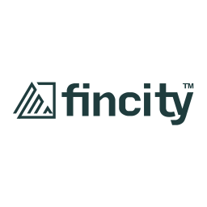

# Fincity

  

Hi Fellow coders,

Fincity is on its way to evolve as a technology leader in many Finance verticals. We are taking up challenges and breaking the Finance domain space's precast moulds. We are aggressively looking for people with the mindset to look in and out of the box. We are looking for people who can figure out _how many sides a circle has and justify_. Your career here will have an impact on people's financial lives. You will help us build the capabilities needed for the economic well-being of an individual or an organization. We challenge ourselves to create an inclusive work environment where we are open to new ideas and never dismiss an idea with prejudice. You will be enabled and empowered to take risks for the right idea.

Our inclusive team of developers, coders, and rebels push all the limits to lose "im" and make everything possible. And you will be part of this team.

The qualities we are looking for are

- **Your love to code**
- **Your love to code**
- **Your love to code**
- and you know how the list goes...

Skills and experience

- Java\*
- Javascript\*
- ReactJS\*
- Reactive Programming\*
- Spring Boot\*\*
- MySQL\*\*
- MongoDB\*\*\*\*
- AWS\*\*\*\*
- Devops\*\*\*\*
- Linux\*\*\*\*
- Build Pipelines\*\*\*\*
- SAAS Product Development\*\*\*\*

_\* Good to have for people with no experience but required for others_

_\*\* Good to have for people with 0-2 years of experience but required for others_

_\*\*\*\* Good to have for people with 0-4 years of experience but required for others_

Choose one or many of the following problem statements and send a github repository link for solution and your resume or cv to **careers(_at_)fincity(_dot_)com**.

If you have x number of years experience we suggest you solve the problems that sum upto the x+1 points. Example: If you have 8 years of experience you should solve 1, 3 (totals 9) or 1, 4 and 5 (totals 9). If you have 0 years of experience you can choose any one problem.

While we appreciate a submission from you, we will not be so pleased to learn if you waste your and our time with plagiarism.

All the best.

P.S.: If you make any assumptions, please let us know the reasoning behind.

Thank you,

**Fincity product development team**

### List of problems

1. [Developer Strange in the Multidimension of Madness](multidimension.md) - 5 points
2. [Bat programmer in the Arkham City help Bat Man capture Asylum escapees](arkhamcity.md) - 1 point
3. [Ironman's legacy in trouble](ironman.md) - 4 points
4. [Groot's pie finder](groot.md) - 2 points
5. [Superman and Bottle City of Kandor](superman.md) - 2 points
